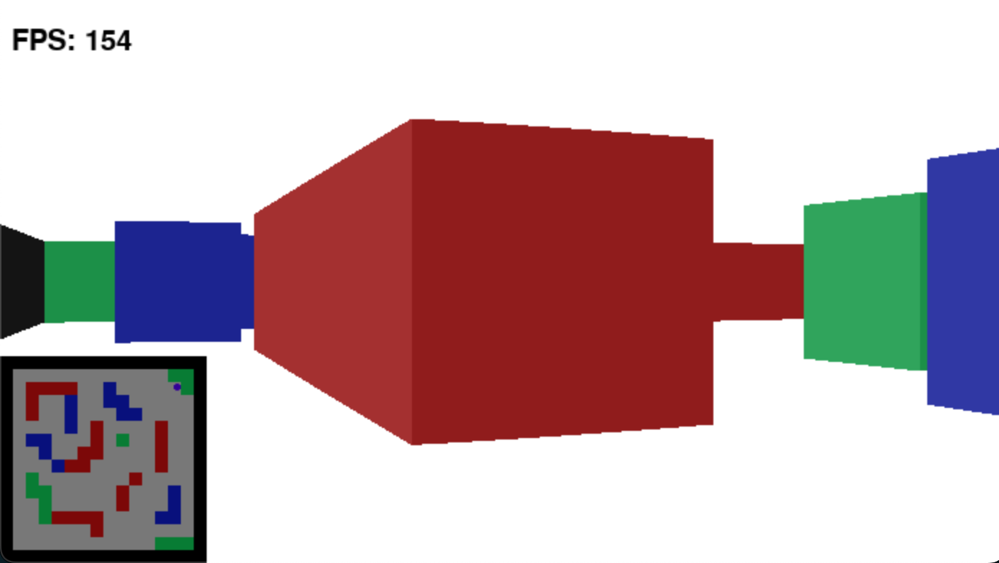

# Rustcaster

This is a recreation of a raycaster I wrote in 2019, one of my earliest projects.
It's fairly barebones, without much beyond the standard raycasting algorithm used in games like Wolfenstein 3D.
There are implementations in Python, Rust, and C++ in various states of progress.

### Screenshot from the python version

